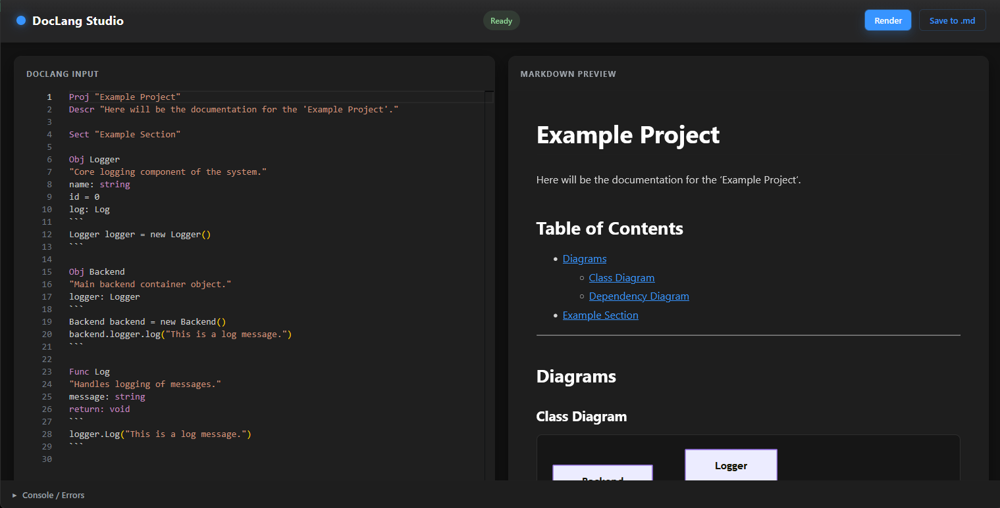

<div align="center">

# DocLang

**A modern document language for structured content generation**

Transform `.dlang` files into rich output using a powerful language server, CLI, and browser-based editor.

<br>

[]()
[]()
[]()
[]()

<br>

[Overview](#-overview) • [Studio](#-doclang-studio) • [Quick Start](#-quick-start) • [VS Code](#-vs-code-extension) • [CLI](#-cli)

</div>

---

## ✨ Overview

DocLang is a domain-specific language for creating structured documents with a modern authoring experience.

<br>

### Features

* ⚡ Langium-powered language infrastructure
* 🖥️ Browser-based editor (**DocLang Studio**)
* 🧩 VS Code extension with LSP support
* ⚙️ CLI tooling for automation
* ✅ Validation, diagnostics, and code intelligence

---

## 📸 DocLang Studio

Write, validate, and render `.dlang` documents directly in your browser.

<br>

<p align="center">
  
</p>

<br>

---

## 🚀 Quick Start

### Start the Web Editor

```bash
npm run dev
```

The editor is available at:

```text
http://localhost:20002
```

### Build the Project

```bash
npm run langium:generate
npm run build
```

---

## 🧩 VS Code Extension

Package the extension:

```bash
cd packages/extension
vsce package --allow-missing-repository
```

Install it:

```bash
code --install-extension ./vscode-doc-lang-0.0.1.vsix
```

---

## ⚡ CLI

Install globally:

```bash
cd packages/cli
npm link
```

Generate output:

```bash
doc-lang generate examples/first-example.dlang
```

Run without installation:

```bash
node packages/cli/bin/cli.js generate examples/first-example.dlang
```

---

## 📝 Examples

For examples, also including source code, from which the .dlang files are derived, see the [examples](./examples) folder.

---

## 📦 Project Structure

```text
packages/
├── cli/
├── extension/
├── language/
└── web/
```

---

## 🏗️ Technology Stack

* Langium
* TypeScript
* Node.js
* Vite
* VS Code Language Server Protocol

