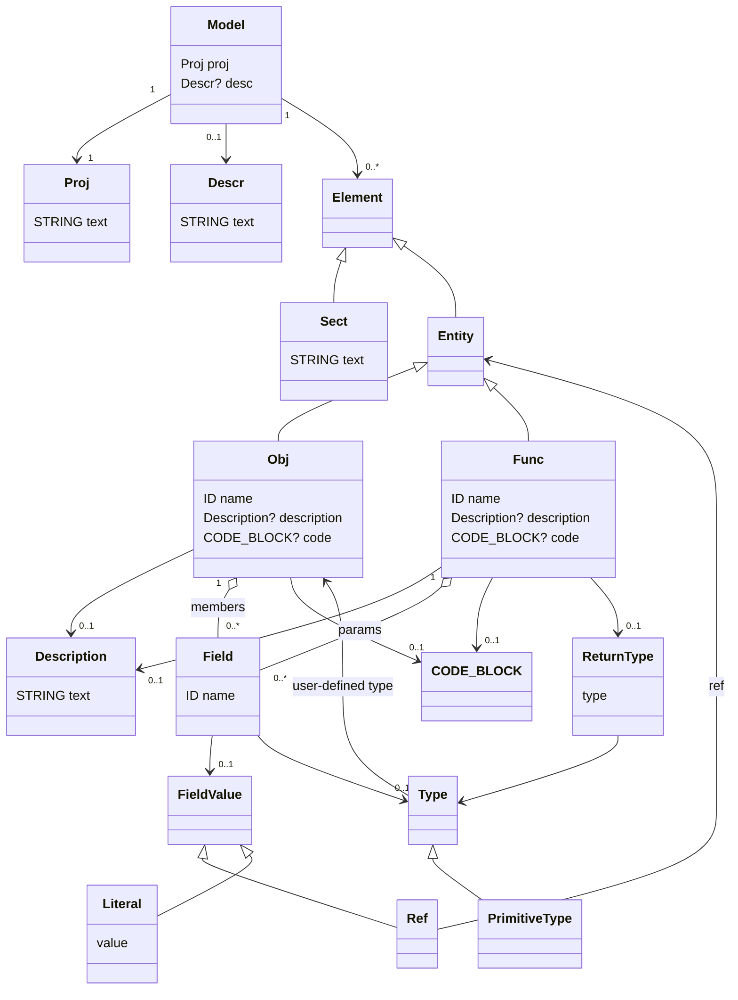

```mermaid
classDiagram

%% =======================
%% Root Model
%% =======================
class Model {
  Proj proj
  Descr? desc
}

class Proj {
  STRING text
}

class Descr {
  STRING text
}

Model "1" --> "1" Proj
Model "0..1" --> Descr
Model "1" --> "0..*" Element

%% =======================
%% Elements
%% =======================
class Element

class Sect {
  STRING text
}

class Entity

Element <|-- Sect
Element <|-- Entity

%% =======================
%% Entities
%% =======================
class Obj {
  ID name
  Description? description
  CODE_BLOCK? code
}

class Func {
  ID name
  Description? description
  CODE_BLOCK? code
}

Entity <|-- Obj
Entity <|-- Func

%% =======================
%% Shared Concepts
%% =======================
class Description {
  STRING text
}

class Field {
  ID name
}

Obj --> "0..1" Description
Func --> "0..1" Description

%% members / params
Obj "1" o-- "0..*" Field : members
Func "1" o-- "0..*" Field : params

Obj --> "0..1" CODE_BLOCK
Func --> "0..1" CODE_BLOCK

%% =======================
%% Field System
%% =======================
class FieldValue
class Ref
class Literal {
  value
}

Field --> "0..1" FieldValue

FieldValue <|-- Ref
FieldValue <|-- Literal

%% reference to entities
Ref --> Entity : ref

%% =======================
%% Types
%% =======================
class Type
class PrimitiveType

Type <|-- PrimitiveType

class ReturnType {
  type
}

Func --> "0..1" ReturnType
ReturnType --> Type

Field --> "0..1" Type

%% Obj reference type (user-defined types)
Type --> Obj : user-defined type
```
