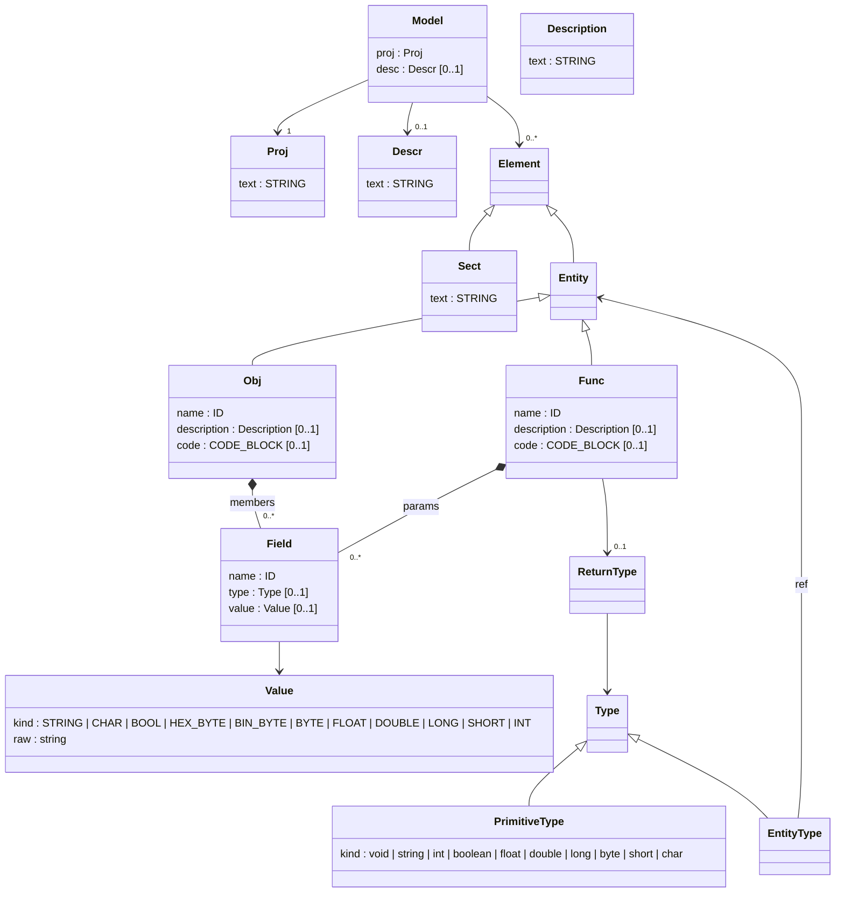

```mermaid
classDiagram

%% =======================
%% Root
%% =======================
class Model {
  proj : Proj
  desc : Descr [0..1]
}

class Proj {
  text : STRING
}

class Descr {
  text : STRING
}

Model --> "1" Proj
Model --> "0..1" Descr
Model --> "0..*" Element

%% =======================
%% Elements
%% =======================
class Element

class Sect {
  text : STRING
}

class Entity

Element <|-- Sect
Element <|-- Entity

%% =======================
%% Entities
%% =======================
class Obj {
  name : ID
  description : Description [0..1]
  code : CODE_BLOCK [0..1]
}

class Func {
  name : ID
  description : Description [0..1]
  code : CODE_BLOCK [0..1]
}

Entity <|-- Obj
Entity <|-- Func

class Description {
  text : STRING
}

%% =======================
%% Fields
%% =======================
class Field {
  name : ID
  type : Type [0..1]
  value : Value [0..1]
}

Obj *-- "0..*" Field : members
Func *-- "0..*" Field : params

%% =======================
%% Return type
%% =======================
class ReturnType
Func --> "0..1" ReturnType
ReturnType --> Type

%% =======================
%% Type system
%% =======================
class Type

class PrimitiveType {
  kind : void | string | int | boolean | float | double | long | byte | short | char
}

class EntityType

Type <|-- PrimitiveType
Type <|-- EntityType
EntityType --> Entity : ref

%% =======================
%% Unified literal system
%% =======================
class Value {
  kind : STRING | CHAR | BOOL | HEX_BYTE | BIN_BYTE | BYTE | FLOAT | DOUBLE | LONG | SHORT | INT
  raw  : string
}

Field --> Value
```
