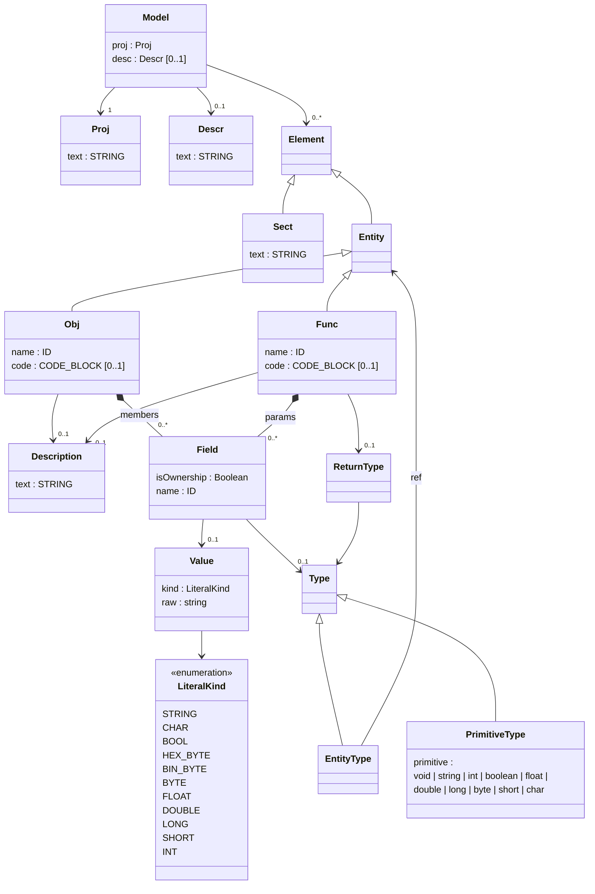

```mermaid
classDiagram

%% =======================
%% Root
%% =======================
class Model {
  proj : Proj
  desc : Descr [0..1]
}

class Proj {
  text : STRING
}

class Descr {
  text : STRING
}

Model --> "1" Proj
Model --> "0..1" Descr
Model --> "0..*" Element

%% =======================
%% Elements
%% =======================
class Element

class Sect {
  text : STRING
}

class Entity

Element <|-- Sect
Element <|-- Entity

%% =======================
%% Entities
%% =======================
class Obj {
  name : ID
  code : CODE_BLOCK [0..1]
}

class Func {
  name : ID
  code : CODE_BLOCK [0..1]
}

Entity <|-- Obj
Entity <|-- Func

class Description {
  text : STRING
}

Obj --> "0..1" Description
Func --> "0..1" Description

%% =======================
%% Members / Parameters
%% =======================
class Field {
  isOwnership : Boolean
  name : ID
}

Obj *-- "0..*" Field : members
Func *-- "0..*" Field : params

Field --> "0..1" Type
Field --> "0..1" Value

%% =======================
%% Return Type
%% =======================
class ReturnType

Func --> "0..1" ReturnType
ReturnType --> Type

%% =======================
%% Type System
%% =======================
class Type

class PrimitiveType {
  primitive :
  void | string | int | boolean | float |
  double | long | byte | short | char
}

class EntityType

Type <|-- PrimitiveType
Type <|-- EntityType

EntityType --> Entity : ref

%% =======================
%% Literal Values
%% =======================
class Value {
  kind : LiteralKind
  raw : string
}

class LiteralKind {
  <<enumeration>>
  STRING
  CHAR
  BOOL
  HEX_BYTE
  BIN_BYTE
  BYTE
  FLOAT
  DOUBLE
  LONG
  SHORT
  INT
}

Value --> LiteralKind
```
