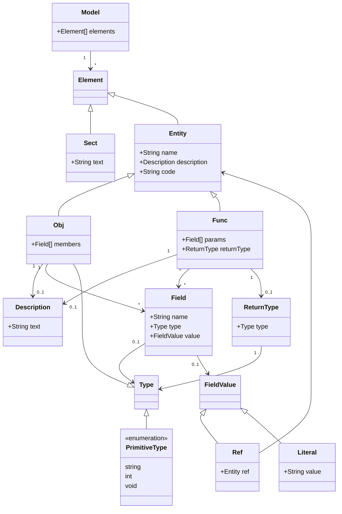

```mermaid
classDiagram

%% =========================
%% Root
%% =========================
class Model {
  +Element[] elements
}

%% =========================
%% Element hierarchy
%% =========================
class Element

class Sect {
  +String text
}

class Entity{
  +String name
  +Description description
  +String code
}

Element <|-- Sect
Element <|-- Entity

%% =========================
%% Entity hierarchy
%% =========================
class Obj {
  +Field[] members
}

class Func {
  +Field[] params
  +ReturnType returnType
}

Entity <|-- Obj
Entity <|-- Func

%% =========================
%% Supporting classes
%% =========================
class Description {
  +String text
}

class Field {
  +String name
  +Type type
  +FieldValue value
}

class ReturnType {
  +Type type
}

%% =========================
%% FieldValue hierarchy
%% =========================
class FieldValue

class Ref {
  +Entity ref
}

class Literal {
  +String value
}

FieldValue <|-- Ref
FieldValue <|-- Literal

%% =========================
%% Type system
%% =========================
class Type

class PrimitiveType {
  <<enumeration>>
  string
  int
  void
}

Type <|-- PrimitiveType
Type <|-- Obj

%% =========================
%% Relationships
%% =========================
Model "1" --> "*" Element
Obj "1" --> "0..1" Description
Obj "1" --> "*" Field
Func "1" --> "0..1" Description
Func "1" --> "*" Field
Func "1" --> "0..1" ReturnType

Field "0..1" --> Type
Field "0..1" --> FieldValue
ReturnType "1" --> Type

Ref --> Entity

```
