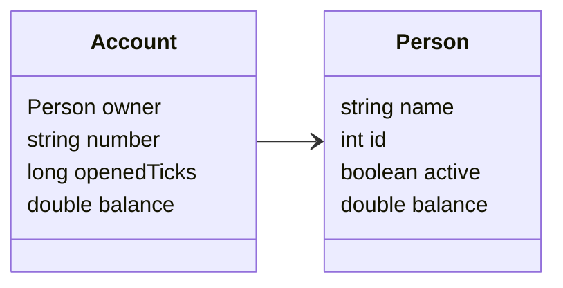
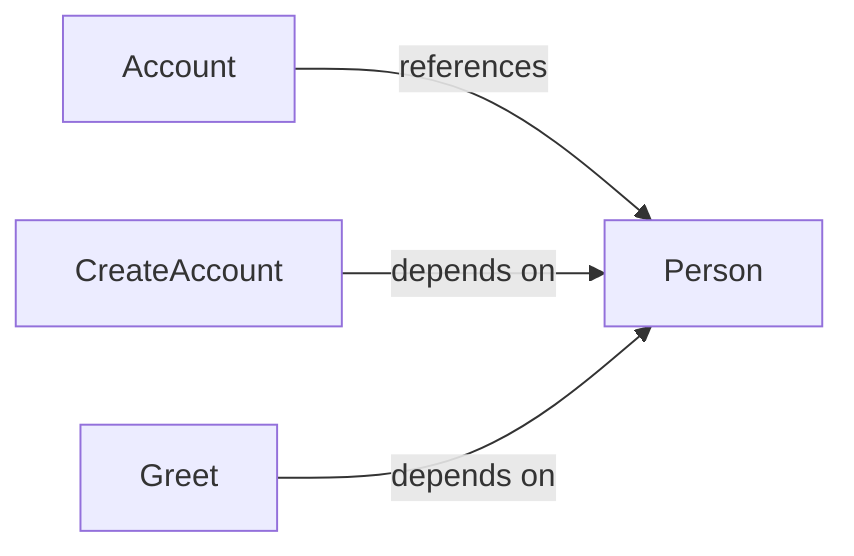

# C# Example

A compact C# example showing `Person` and `Account` objects linked together, multiple field types, and simple functions.

## Table of Contents

- [Diagrams](#diagrams)
  - [Class Diagram](#class-diagram)
  - [Dependency Diagram](#dependency-diagram)
- [Overview](#overview)

---

## Diagrams {#diagrams}

### Class Diagram {#class-diagram}



### Dependency Diagram {#dependency-diagram}



---

## Overview {#overview}

- [Objects](#overview-objects)
   - [Person](#person)
   - [Account](#account)
- [Functions](#overview-functions)
   - [CreateAccount](#createaccount)
   - [Greet](#greet)

---

### Objects {#overview-objects}

#### `Person` {#person}

Represents a person with mixed primitive fields.

**Fields**

- **name**: `string`
- **id**: `int`
- **active**: `boolean`
- **balance**: `double`

**Usage**
```
var alice = new Person { Name = "Alice", Id = 1, Active = true, Balance = 100.5 };
```


---

#### `Account` {#account}

Bank account linked to a `Person` (demonstrates object linking).

**Fields**

- **owner**: [`Person`](#person)
- **number**: `string`
- **openedTicks**: `long`
- **balance**: `double`

**Usage**
```
var account = new Account { Owner = alice, Number = "ABC-123", OpenedTicks = DateTime.UtcNow.Ticks, Balance = 250.0 };
```

**See also**
[`Person`](#person) 

---

### Functions {#overview-functions}

#### `CreateAccount()` {#createaccount}

Creates an `Account` for a given `Person` with an initial deposit.

**Parameters**

- **owner**: [`Person`](#person)
- **initialDeposit**: `double`

**Returns**: [`Account`](#account)

**Usage**
```
var account = Bank.CreateAccount(alice, 250.0);
```

**See also**
[`Person`](#person) 

---

#### `Greet()` {#greet}

Returns a greeting for a `Person`.

**Parameters**

- **person**: [`Person`](#person)

**Returns**: `string`

**Usage**
```
Bank.Greet(alice)
```

**See also**
[`Person`](#person) 

---

