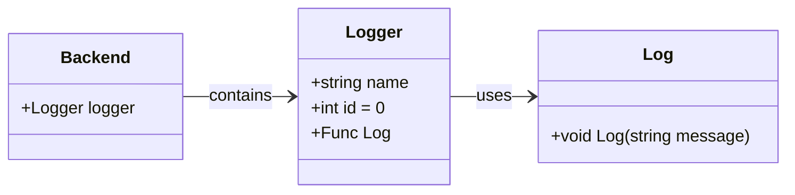
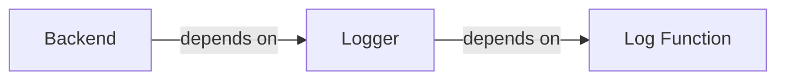

# Wiki Page for "Example Project"

Here will be the documentation for the "Example Project".

## Table of Contents

- [Diagrams](#00)
  - [Class Diagram](#00-01)
  - [Dependency Diagram](#00-02)
- [Example Section](#01)

---

## Diagrams {#00}

### Class Diagram {#00-01}



## Dependency Diagram {#00-02}



---

## Example Section {#01}

- [Objects](#01-01)
   - [Logger](#01-01-01)
   - [Backend](#01-01-02)
- [Functions](#01-02)
   - [Log](#01-02-01)

---

### Objects {#01-01}

#### `Logger` {#01-01-01}

Core logging component of the system.

**Fields**

- **name**: `string`
- **id**: `int` = 0
- **Log**: `Func` = [`Log`](#01-02-01)

**Usage**
```
Logger logger = new Logger();
```

**See also**
[`Log`](#01-02-01) [`Backend`](#01-01-02) 

---

#### `Backend` {#01-01-02}

Main backend container object.

**Fields**

- **logger**: [`Logger`](#01-01-01)

**Usage**
```
Backend backend = new Backend();
backend.logger.log("This is a log message.");
```

**See also**
[`Logger`](#01-01-01)

---
### Functions {#01-02}

#### `Log` {#01-02-01}

Handles logging of messages.

**Parameters**
- **message**: `string`

**Returns**: `void`

**Usage**
```
logger.Log("This is a log message.");
```

**See also**
[`Logger`](#01-01-01)
