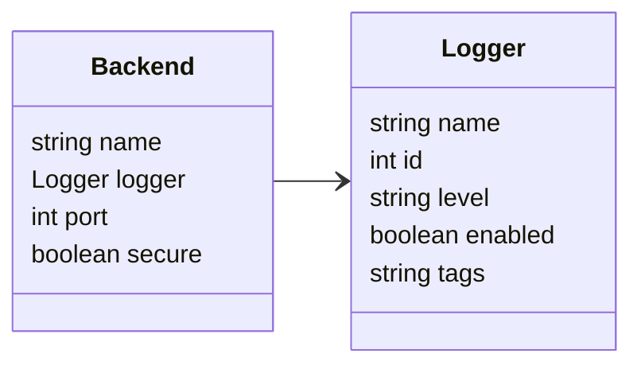
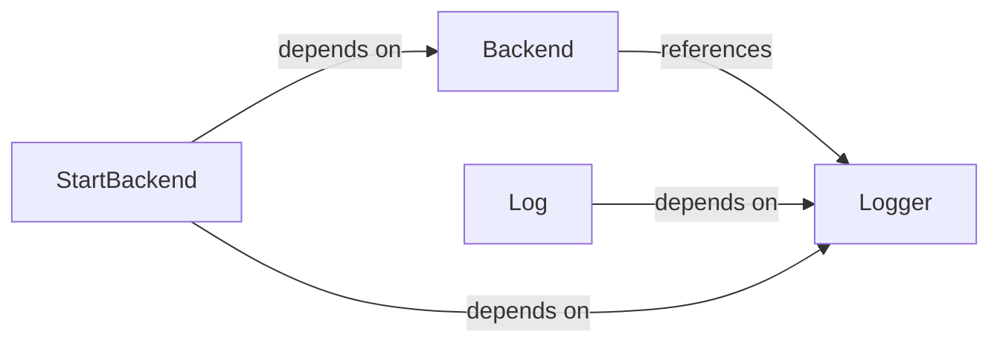

# Tcl Example

Simplified Tcl sample focusing on interlinked `Logger` and `Backend` objects and functions that operate on them. Shows multiple field types and object links.

## Table of Contents

- [Diagrams](#diagrams)
  - [Class Diagram](#class-diagram)
  - [Dependency Diagram](#dependency-diagram)
- [Overview](#overview)

---

## Diagrams {#diagrams}

### Class Diagram {#class-diagram}



### Dependency Diagram {#dependency-diagram}



---

## Overview {#overview}

- [Objects](#overview-objects)
   - [Logger](#logger)
   - [Backend](#backend)
- [Functions](#overview-functions)
   - [Log](#log)
   - [StartBackend](#startbackend)

---

### Objects {#overview-objects}

#### `Logger` {#logger}

Core logging component with several field types and example tags list.

**Fields**

- **name**: `string`
- **id**: `int`
- **level**: `string`
- **enabled**: `boolean`
- **tags**: `string`

**Usage**
```
set logger [dict create name "app-logger" id 1 level "INFO" enabled 1 tags "core,audit"]
```


---

#### `Backend` {#backend}

Backend container that links to a `Logger`.

**Fields**

- **name**: `string`
- **logger**: [`Logger`](#logger)
- **port**: `int`
- **secure**: `boolean`

**Usage**
```
set backend [dict create name "main-backend" logger_id [dict get $logger id] port 8080 secure 0]
```

**See also**
[`Logger`](#logger) 

---

### Functions {#overview-functions}

#### `Log()` {#log}

Logs a message using a `Logger` object.

**Parameters**

- **logger**: [`Logger`](#logger)
- **message**: `string`
- **level**: `string`

**Returns**: `void`

**Usage**
```
::app::log $::app::logger "Initializing" "INFO"
```

**See also**
[`Logger`](#logger) 

---

#### `StartBackend()` {#startbackend}

Starts a backend and emits a startup log via its linked logger.

**Parameters**

- **backend**: [`Backend`](#backend)
- **logger**: [`Logger`](#logger)

**Returns**: `void`

**Usage**
```
::app::start_backend $::app::backend $::app::logger
```

**See also**
[`Backend`](#backend) [`Logger`](#logger) 

---

