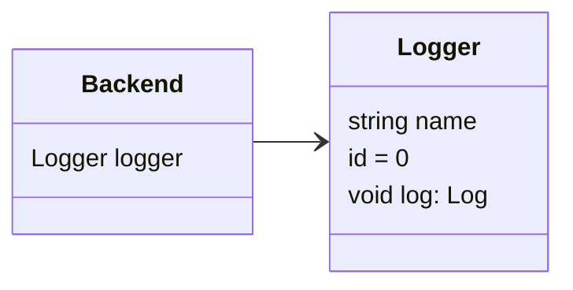
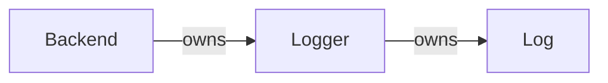

# Example Project

Here will be the documentation for the 'Example Project'.

## Table of Contents

- [Diagrams](#diagrams)
  - [Class Diagram](#class-diagram)
  - [Dependency Diagram](#dependency-diagram)
- [Example Section](#example-section)

---

## Diagrams {#diagrams}

### Class Diagram {#class-diagram}



### Dependency Diagram {#dependency-diagram}



---

## Example Section {#example-section}

- [Objects](#example-section-objects)
   - [Logger](#logger)
   - [Backend](#backend)
- [Functions](#example-section-functions)
   - [Log](#log)

---

### Objects {#example-section-objects}

#### `Logger` {#logger}

Core logging component of the system.

**Fields**

- **name**: `string`
- **id**
- **log**: [`Log`](#log)

**Usage**
```
Logger logger = new Logger()
```

**See also**
[`Log`](#log) 

---

#### `Backend` {#backend}

Main backend container object.

**Fields**

- **logger**: [`Logger`](#logger)

**Usage**
```
Backend backend = new Backend()
backend.logger.log("This is a log message.")
```

**See also**
[`Logger`](#logger) 

---

### Functions {#example-section-functions}

#### `Log()` {#log}

Handles logging of messages.

**Parameters**

- **message**: `string`

**Returns**: `void`

**Usage**
```
logger.Log("This is a log message.")
```


---

