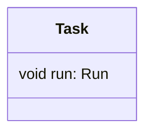
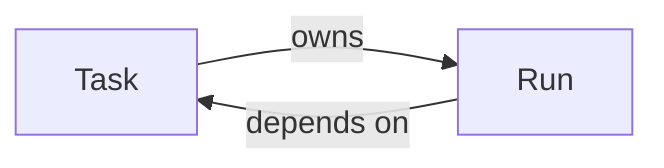

# Linked Entities

Object references a function and function depends on object.

## Table of Contents

- [Diagrams](#diagrams)
  - [Class Diagram](#class-diagram)
  - [Dependency Diagram](#dependency-diagram)

---

## Diagrams {#diagrams}

### Class Diagram {#class-diagram}



### Dependency Diagram {#dependency-diagram}



---

- [Objects](#OP5poflVTZDH7ZaO-objects)
   - [Task](#task)
- [Functions](#OP5poflVTZDH7ZaO-functions)
   - [Run](#run)

---

### Objects {#OP5poflVTZDH7ZaO-objects}

#### `Task` {#task}

Task entity.

**Fields**

- **run**: [`Run`](#run)

**Usage**
```
Task task = new Task()
task.run()
```

**See also**
[`Run`](#run) 

---

### Functions {#OP5poflVTZDH7ZaO-functions}

#### `Run()` {#run}

Runs a task.

**Parameters**

- **task**: [`Task`](#task)

**Returns**: `void`

**Usage**
```
task.run()
```

**See also**
[`Task`](#task) 

---

