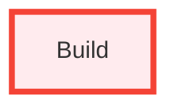

# Single Function

## Table of Contents

- [Diagrams](#diagrams)
  - [Class Diagram](#class-diagram)
  - [Dependency Diagram](#dependency-diagram)

---

## Diagrams {#diagrams}

### Class Diagram {#class-diagram}

```mermaid
classDiagram
direction LR

```

### Dependency Diagram {#dependency-diagram}



---

- [Functions](#L7RM07_cpToi3fq0-functions)
   - [Build](#build)

---

### Functions {#L7RM07_cpToi3fq0-functions}

#### `Build()` {#build}

Builds the project.

**Parameters**

- **target**: `string`

**Returns**: `void`

**Usage**
```
Build("app")
```


---

