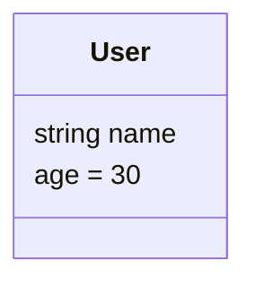
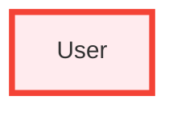

# Single Object

Object with a default value and a code sample.

## Table of Contents

- [Diagrams](#diagrams)
  - [Class Diagram](#class-diagram)
  - [Dependency Diagram](#dependency-diagram)

---

## Diagrams {#diagrams}

### Class Diagram {#class-diagram}



### Dependency Diagram {#dependency-diagram}



---

- [Objects](#edudIlS9aWqk1BEX-objects)
   - [User](#user)

---

### Objects {#edudIlS9aWqk1BEX-objects}

#### `User` {#user}

Represents a system user.

**Fields**

- **name**: `string`
- **age**

**Usage**
```
User user = new User()
```


---

