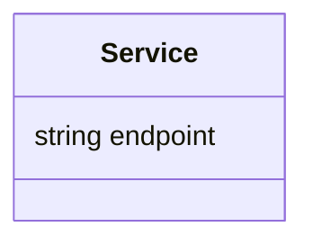
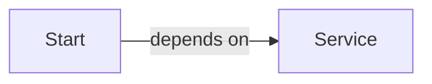

# Multi Section

Project with two sections.

## Table of Contents

- [Diagrams](#diagrams)
  - [Class Diagram](#class-diagram)
  - [Dependency Diagram](#dependency-diagram)
- [Entities](#entities)
- [Operations](#operations)

---

## Diagrams {#diagrams}

### Class Diagram {#class-diagram}



### Dependency Diagram {#dependency-diagram}



---

## Entities {#entities}

- [Objects](#entities-objects)
   - [Service](#service)

---

### Objects {#entities-objects}

#### `Service` {#service}

Service object.

**Fields**

- **endpoint**: `string`

**Usage**
```
Service service = new Service()
```


---

## Operations {#operations}

- [Functions](#operations-functions)
   - [Start](#start)

---

### Functions {#operations-functions}

#### `Start()` {#start}

Starts the service.

**Parameters**

- **service**: [`Service`](#service)

**Returns**: `void`

**Usage**
```
service.start()
```

**See also**
[`Service`](#service) 

---

